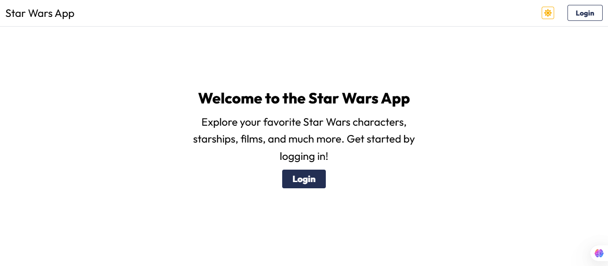
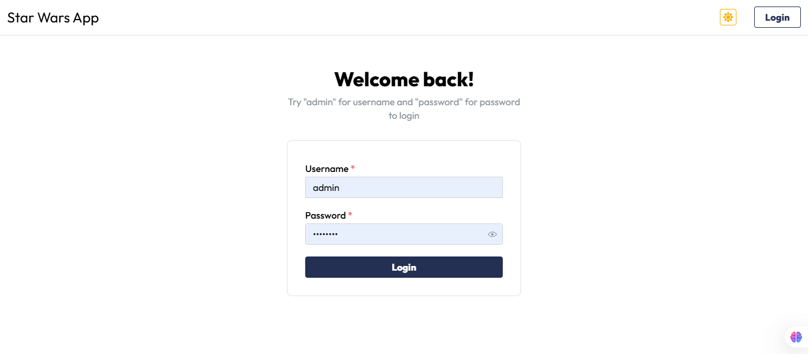
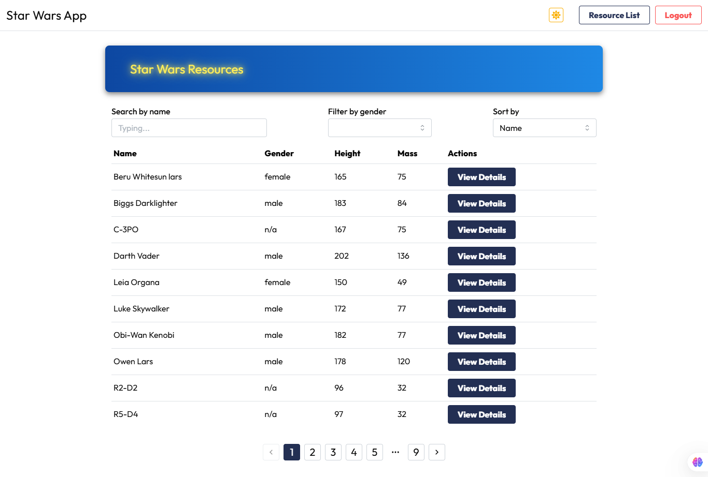
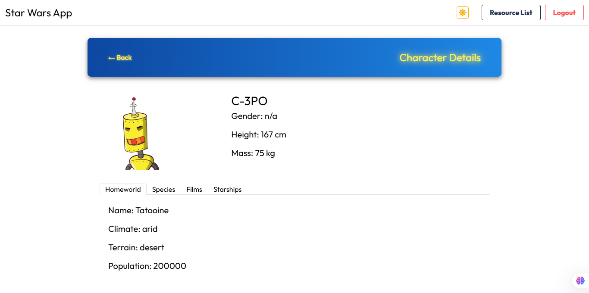

# Star Wars App

A modern web app built using **React**, **Mantine**, and **React Router**, allowing users to explore Star Wars resources like characters, starships, and planets. The app includes **authentication**, **dynamic theming (light/dark mode)**, and **private routes**.

## Features

- **Authentication**: Users can log in to access private resources.
- **Light/Dark Mode**: Users can toggle between light and dark modes.
- **Dynamic Routing**: The app uses React Router to manage navigation between pages.
- **Private Routes**: Certain pages (like the Resource List and Resource Detail) are accessible only to authenticated users.
- **Resource List**: Displays a list of Star Wars resources (e.g., people, starships, planets).
- **Resource Details**: Displays detailed information about a selected resource, including related data like films and species.

## Tech Stack

- **React**: JavaScript library for building user interfaces.
- **Mantine**: React component library with a beautiful, modern UI and support for light/dark mode.
- **React Router**: Library for routing and navigation in React applications.
- **Zustand**: State management library for handling authentication and user state.
- **React Query**: Library for fetching, caching, and syncing data with APIs.
- **React Icons**: A library of customizable icons for React.

## Usage

- **Landing Page**: When the user accesses the app, they land on the **Home page** (root path `/`). If they are authenticated, they are automatically redirected to the **Resource List**.
- **Login Page**: Users can log in to access protected routes (e.g., `/resources`).
- **Resource List**: Displays a list of available Star Wars resources (e.g., characters, starships, etc.).
- **Resource Detail**: After selecting a resource, users can view detailed information, including related data like films, species, and starships.

## Screenshots

### Landing Page

### Login Page

### Resource List

### Resource Detail

  

## Contributing

If you want to contribute to this project, feel free to fork the repository, make changes, and submit a pull request.

Please ensure that your code follows the project's coding standards and passes tests (if applicable).

## License

This project is licensed under the **MIT License** - see the [LICENSE](./LICENSE) file for details.
